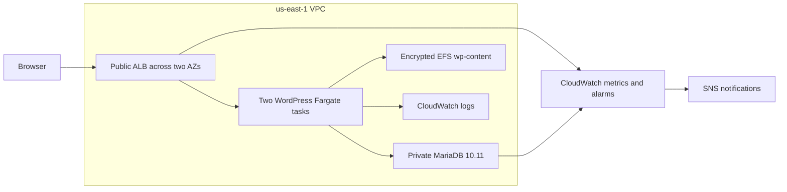
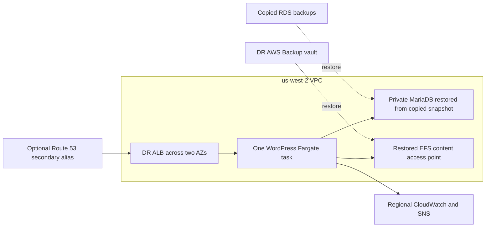
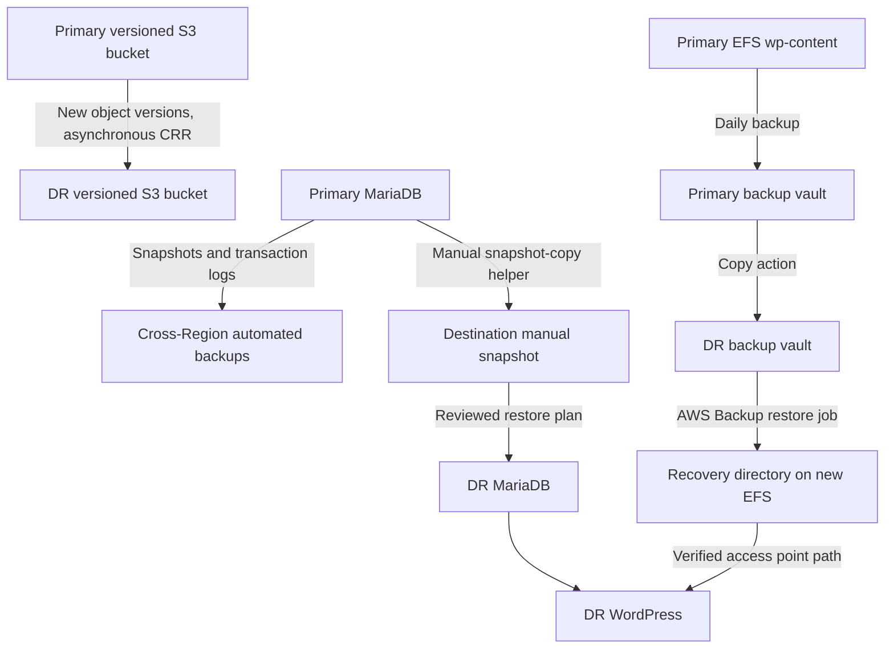

# Architecture figures

These diagrams describe the enhanced Terraform design, not an observed deployment.

## Figure 1. Primary Region, us-east-1

Fargate tasks use public IPs for outbound image/log/SSM connectivity. Their security
 group permits inbound HTTP only from the ALB; no NAT gateway or EC2 host is created.

## Figure 2. Recovery Region, us-west-2

Initially the DR DB and EFS are empty independent stores. Restore and validate
content before enabling DNS failover. Database and EFS recovery are coordinated
procedures; the diagram does not imply synchronous replication.

## Figure 3. Backup and replication flow

The RPO of the complete application is constrained by its least-current compatible
recovery component. For the lab, stop application writes while creating the paired
RDS/EFS recovery points; retain timestamps and verify both destination copies.
